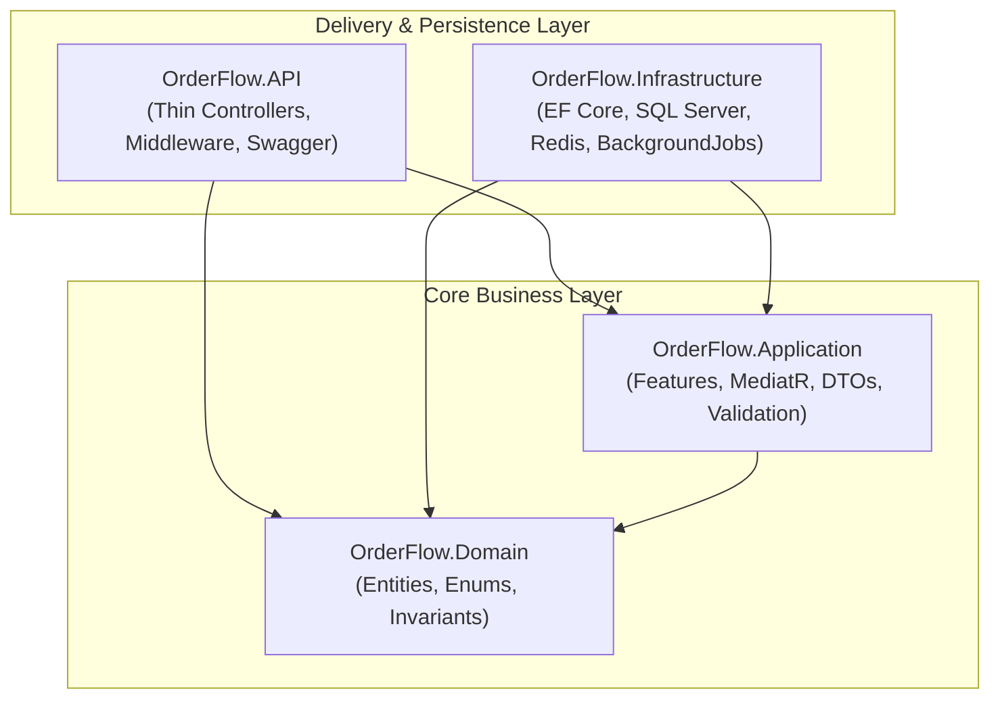
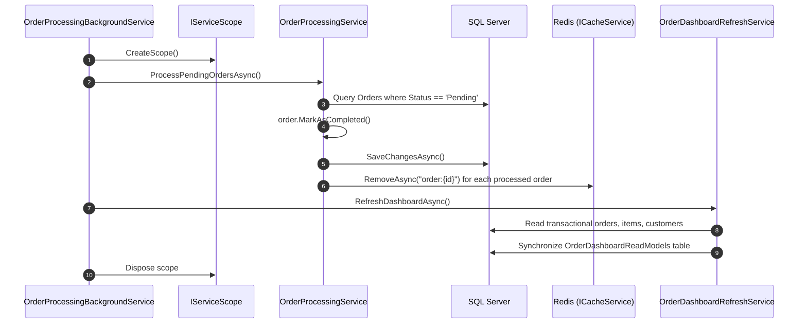
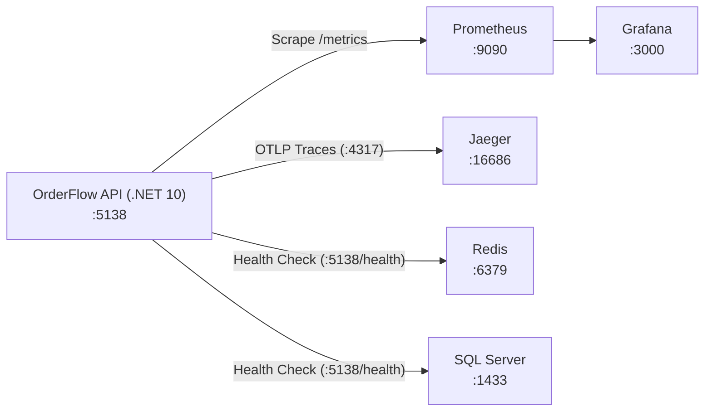
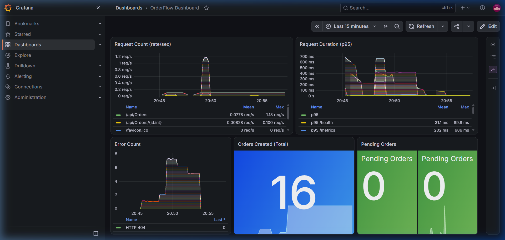
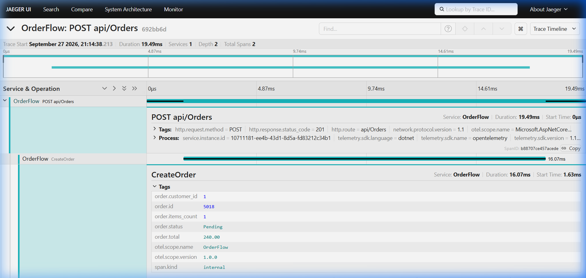
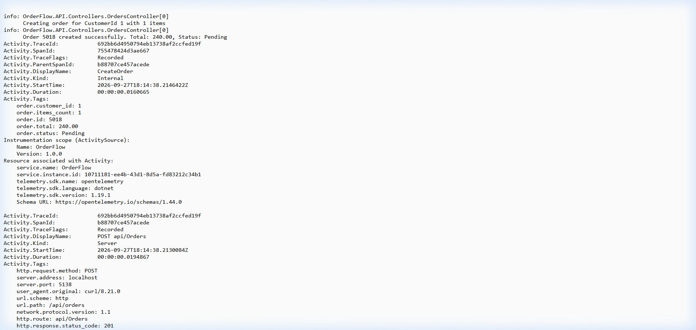
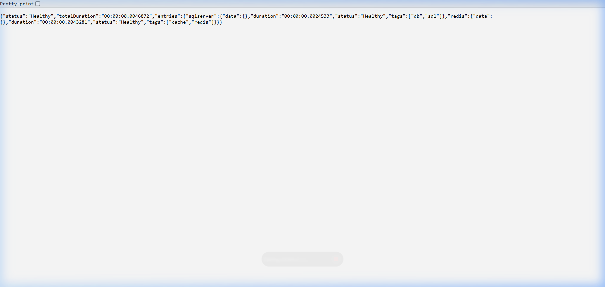
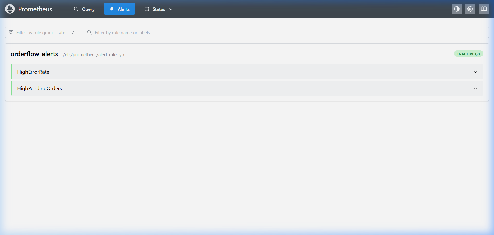

# OrderFlow — Educational .NET 10 E-Commerce Backend

[](https://dotnet.microsoft.com/)
[](https://docs.microsoft.com/ef/core/)
[](LICENSE)

**OrderFlow** is an educational, production-style e-commerce backend built with **.NET 10**, **C#**, **Entity Framework Core 10**, **SQL Server**, and **Redis**.

The primary purpose of OrderFlow is to illustrate how a simple CRUD backend logically evolves into advanced, high-performance patterns — such as **Clean Architecture**, **Vertical Slice Architecture**, **CQRS (Command Query Responsibility Segregation)**, **Redis Caching**, **Materialized Views (Read Models)**, and **Resilient Background Processing** — while remaining readable, clean, and practical for classroom walkthroughs and developer training.

---

## Table of Contents

- [1. Business Scenario](#1-business-scenario)
- [2. Architecture & Design Principles](#2-architecture--design-principles)
  - [Clean Architecture Layers](#clean-architecture-layers)
  - [Vertical Slice Architecture](#vertical-slice-architecture)
  - [CQRS: Commands vs. Queries](#cqrs-commands-vs-queries)
- [3. Sources of Truth & Data Models](#3-sources-of-truth--data-models)
  - [Transactional Model (Source of Truth)](#transactional-model-source-of-truth)
  - [Materialized View / Read Model](#materialized-view--read-model)
  - [Redis Caching & Invalidation](#redis-caching--invalidation)
- [4. Background Processing & Scoping](#4-background-processing--scoping)
  - [The Singleton-to-Scoped Dependency Problem](#the-singleton-to-scoped-dependency-problem)
  - [Lifecycle: Pending to Completed](#lifecycle-pending-to-completed)
- [5. Project Structure](#5-project-structure)
- [6. Database Indexes](#6-database-indexes)
- [7. API Endpoints & Usage](#7-api-endpoints--usage)
- [8. GitHub Quick Start](#8-github-quick-start)
- [9. Running with Docker Compose](#9-running-with-docker-compose)
- [10. Running Automated Tests](#10-running-automated-tests)
- [11. Architectural Trade-offs & Philosophy](#11-architectural-trade-offs--philosophy)
- [12. Monitoring & Observability Stack](#12-monitoring--observability-stack)
  - [1. Visual Evidence & Live UIs Showcase](#1-visual-evidence--live-uis-showcase)
  - [2. Core Metrics Catalog](#2-core-metrics-catalog)
  - [3. Implementation Highlights (.NET 10 & OpenTelemetry)](#3-implementation-highlights-net-10--opentelemetry)
  - [4. Hands-on Walkthrough: Running & Verifying the Stack](#4-hands-on-walkthrough-running--verifying-the-stack)
  - [5. Detailed Verification Report](#5-detailed-verification-report)

---

## 1. Business Scenario

OrderFlow simulates a core e-commerce order-management system:

1. **Browsing & Placing Orders**: Customers select products and submit an order with desired quantities.
2. **Server-Side Validation & Pricing**: The client never submits product names, prices, or totals. The backend fetches product records from SQL Server, captures price snapshots at that instant, calculates line totals and aggregate order totals on the server, and saves the order in `Pending` status.
3. **High-Performance Order Inquiries**: Customers frequently retrieve order status and details. OrderFlow caches order details in Redis with an expiration TTL (Time-To-Live) and falls back to SQL Server on cache misses.
4. **Order Fulfillment Automation**: An asynchronous `BackgroundService` runs periodically, moves pending orders to `Completed`, invalidates stale Redis cache entries, and rebuilds the denormalized dashboard read model.
5. **Real-time Order Dashboard**: Store managers view order summaries. Instead of executing heavy table joins across transactional records on every request, the dashboard queries a pre-aggregated Materialized View table (`OrderDashboardReadModels`).

---

## 2. Architecture & Design Principles



### Clean Architecture Layers

Dependency rules flow strictly inward:

- **`OrderFlow.Domain`**: Pure business domain. Contains entities (`Customer`, `Product`, `Order`, `OrderItem`), enums (`OrderStatus`), and domain rules. It has zero external dependencies on EF Core, ASP.NET Core, or Redis.
- **`OrderFlow.Application`**: Application use cases. Contains MediatR commands, queries, handlers, DTOs, FluentValidation rules, and abstractions (`IOrderRepository`, `ICacheService`, etc.). It has no reference to infrastructure or persistence technologies.
- **`OrderFlow.Infrastructure`**: Concrete adapters. Implements database access using EF Core 10, SQL Server migrations, Redis cache service, read model maintenance, and background workers.
- **`OrderFlow.API`**: Presentation layer. Thin ASP.NET Core controllers dispatching requests to MediatR, configuring OpenAPI/Swagger, and handling global exceptions.

### Vertical Slice Architecture

Inside `OrderFlow.Application`, features are organized by use case rather than horizontal technical folders:

```text
OrderFlow.Application/
└── Features/
    └── Orders/
        ├── CreateOrder/
        │   ├── CreateOrderCommand.cs
        │   ├── CreateOrderHandler.cs
        │   └── CreateOrderValidator.cs
        ├── GetOrderById/
        │   ├── GetOrderByIdQuery.cs
        │   └── GetOrderByIdHandler.cs
        ├── GetOrders/
        │   ├── GetOrdersQuery.cs
        │   └── GetOrdersHandler.cs
        └── GetDashboardOrders/
            ├── GetDashboardOrdersQuery.cs
            └── GetDashboardOrdersHandler.cs
```

Each slice encapsulates everything required for that specific business operation: command/query, validation, and execution logic.

### CQRS: Commands vs. Queries

| Concept | Purpose | Modifies State? | Data Source |
|---|---|---|---|
| **Commands** (`CreateOrderCommand`) | Intent to change system state | Yes | SQL Server Transactional Tables |
| **Queries** (`GetOrdersQuery`) | Read order list | No | SQL Server Transactional Tables (`AsNoTracking()`) |
| **Queries** (`GetOrderByIdQuery`) | Read detailed order | No | Redis Cache first, then SQL Server fallback |
| **Queries** (`GetDashboardOrdersQuery`) | Read dashboard metrics | No | `OrderDashboardReadModels` (Read Model Table) |

---

## 3. Sources of Truth & Data Models

### Transactional Model (Source of Truth)

SQL Server transactional tables represent the **single source of truth** for all business transactions:

- `Customers` (Id, Name)
- `Products` (Id, Name, Price)
- `Orders` (Id, CustomerId, Status, CreatedAt, Total)
- `OrderItems` (Id, OrderId, ProductName, Quantity, UnitPrice)

#### Historical Immutability (Snapshot Pattern)
When an order item is created, it captures a **snapshot** of the product's name and price at that exact moment. If the product's catalog price or title changes later, the customer's historical order remains unchanged.

### Materialized View / Read Model

`OrderDashboardReadModels` is a dedicated SQL table optimized exclusively for dashboard queries:

```text
=========================================================
READ MODEL ONLY — NOT THE SOURCE OF TRUTH
=========================================================
Columns:
- OrderId (PK)
- CustomerName
- ItemCount
- Total
- Status
- CreatedAt
```

Why? In a traditional relational system, generating a dashboard requires joining `Orders`, `Customers`, and `OrderItems` and computing aggregates (`COUNT(Items)`, `SUM(Total)`). Under high traffic, this causes lock contention and slow response times.

By reading from `OrderDashboardReadModels`, the dashboard query executes a simple `SELECT` on a flat table without any runtime joins or aggregate computations.

### Redis Caching & Invalidation

The `GET /api/orders/{id}` endpoint utilizes Redis caching:

1. Request arrives for `GET /api/orders/{id}`.
2. Build cache key: `order:{id}`.
3. Check Redis:
   - **Cache Hit**: Deserialize cached `OrderDetailsDto` and return immediately.
   - **Cache Miss**: Query SQL Server transactional tables using `AsNoTracking()`, map to DTO, store in Redis with configured expiration (`Caching:OrderDetailsExpirationMinutes`), and return DTO.
4. **Resilience**: If Redis is temporarily unavailable or offline, the cache service catches the socket/connection exception, logs a warning, and falls back to SQL Server seamlessly.
5. **Cache Invalidation**: When the background worker transitions an order from `Pending` to `Completed`, it immediately issues `RemoveAsync("order:{id}")` to prevent clients from viewing stale status.

---

## 4. Background Processing & Scoping

### The Singleton-to-Scoped Dependency Problem

`BackgroundService` is registered in ASP.NET Core as a **Singleton**. However, Entity Framework's `DbContext` and repository interfaces are registered as **Scoped** (created per HTTP request).

> [!CAUTION]
> Directly injecting a scoped service (`OrderFlowDbContext` or repositories) into a singleton `BackgroundService` will cause memory leaks, concurrency violations, and runtime exceptions.

### Solution: `IServiceScopeFactory`

`OrderProcessingBackgroundService` injects `IServiceScopeFactory`. On every timer tick, it creates an explicit dependency scope:

```csharp
using var scope = _scopeFactory.CreateScope();

var orderProcessingService = scope.ServiceProvider.GetRequiredService<IOrderProcessingService>();
var dashboardRefreshService = scope.ServiceProvider.GetRequiredService<IOrderDashboardRefreshService>();

await orderProcessingService.ProcessPendingOrdersAsync(stoppingToken);
await dashboardRefreshService.RefreshDashboardAsync(stoppingToken);
```

When the `using` block terminates, all scoped services and DbContext instances are safely disposed.

### Lifecycle: Pending to Completed

Every 30 seconds (configurable via `BackgroundJobs:IntervalSeconds`):



---

## 5. Project Structure

```text
OrderFlow/
├── OrderFlow.sln
├── docker-compose.yml
├── .gitignore
├── .editorconfig
├── LICENSE
├── README.md
│
├── monitoring/
│   ├── grafana/
│   │   ├── dashboards/
│   │   │   └── orderflow-dashboard.json
│   │   └── provisioning/
│   │       ├── dashboards/
│   │       │   └── dashboards.yml
│   │       └── datasources/
│   │           └── datasources.yml
│   └── prometheus/
│       ├── alert_rules.yml
│       └── prometheus.yml
│
├── src/
│   ├── OrderFlow.Domain/
│   │   ├── Common/
│   │   ├── Entities/
│   │   │   ├── Customer.cs
│   │   │   ├── Product.cs
│   │   │   ├── Order.cs
│   │   │   └── OrderItem.cs
│   │   ├── Enums/
│   │   │   └── OrderStatus.cs
│   │   └── Exceptions/
│   │       └── DomainException.cs
│   │
│   ├── OrderFlow.Application/
│   │   ├── Common/
│   │   │   ├── Behaviors/
│   │   │   │   └── ValidationBehavior.cs
│   │   │   ├── Exceptions/
│   │   │   │   ├── NotFoundException.cs
│   │   │   │   ├── BadRequestException.cs
│   │   │   │   └── ValidationException.cs
│   │   │   └── Options/
│   │   │       └── CachingOptions.cs
│   │   ├── DTOs/
│   │   │   ├── CreateOrderRequest.cs
│   │   │   ├── CreateOrderResponse.cs
│   │   │   ├── OrderDetailsDto.cs
│   │   │   ├── OrderListItemDto.cs
│   │   │   └── OrderDashboardDto.cs
│   │   ├── Features/
│   │   │   └── Orders/
│   │   │       ├── CreateOrder/
│   │   │       ├── GetOrderById/
│   │   │       ├── GetOrders/
│   │   │       └── GetDashboardOrders/
│   │   ├── Interfaces/
│   │   │   ├── IOrderRepository.cs
│   │   │   ├── IProductRepository.cs
│   │   │   ├── ICustomerRepository.cs
│   │   │   ├── IOrderDashboardRepository.cs
│   │   │   ├── ICacheService.cs
│   │   │   ├── IOrderProcessingService.cs
│   │   │   └── IOrderDashboardRefreshService.cs
│   │   └── DependencyInjection.cs
│   │
│   ├── OrderFlow.Infrastructure/
│   │   ├── BackgroundServices/
│   │   │   ├── BackgroundJobOptions.cs
│   │   │   └── OrderProcessingBackgroundService.cs
│   │   ├── Caching/
│   │   │   ├── RedisOptions.cs
│   │   │   └── RedisCacheService.cs
│   │   ├── Persistence/
│   │   │   ├── Configurations/
│   │   │   ├── Migrations/
│   │   │   ├── Seed/
│   │   │   │   └── OrderFlowDbContextSeed.cs
│   │   │   └── OrderFlowDbContext.cs
│   │   ├── ReadModels/
│   │   │   └── OrderDashboardReadModel.cs
│   │   ├── Repositories/
│   │   │   ├── CustomerRepository.cs
│   │   │   ├── ProductRepository.cs
│   │   │   ├── OrderRepository.cs
│   │   │   └── OrderDashboardRepository.cs
│   │   ├── Services/
│   │   │   ├── OrderProcessingService.cs
│   │   │   └── OrderDashboardRefreshService.cs
│   │   └── DependencyInjection.cs
│   │
│   └── OrderFlow.API/
│       ├── Controllers/
│       │   ├── OrdersController.cs
│       │   └── DashboardController.cs
│       ├── Middleware/
│       │   └── ExceptionHandlingMiddleware.cs
│       ├── Observability/
│       │   ├── OrderFlowActivitySource.cs
│       │   ├── OrderFlowMetrics.cs
│       │   └── PendingOrdersMetrics.cs
│       ├── appsettings.json
│       ├── appsettings.Development.json
│       └── Program.cs
│
├── submission/
│   ├── VERIFICATION.md
│   └── screenshots/
│       ├── 01-grafana-dashboard.png
│       ├── 02-jaeger-traces.png
│       ├── 03-logs.png
│       ├── 04-health-check.png
│       └── 05-alerts.png
│
└── tests/
    ├── OrderFlow.UnitTests/
    │   ├── Domain/
    │   └── Application/
    └── OrderFlow.IntegrationTests/
        ├── Infrastructure/
        ├── Controllers/
        └── CustomWebApplicationFactory.cs
```

---

## 6. Database Indexes

Carefully chosen indexes support both write transactions and read model maintenance:

1. **`Orders` Table**:
   - `IX_Orders_CustomerId`: Speeds up customer order queries.
   - `IX_Orders_Status`: Used by the background worker to locate `Pending` orders without full table scans.
   - `IX_Orders_CreatedAt`: Optimizes chronological order sorting.
2. **`OrderItems` Table**:
   - `IX_OrderItems_OrderId`: Speeds up joins when retrieving line items for an order.
3. **`OrderDashboardReadModels` Table**:
   - `IX_OrderDashboardReadModels_Status`: Enables instant filtering on dashboard status.
   - `IX_OrderDashboardReadModels_CreatedAt`: Powers chronological dashboard sorting.

---

## 7. API Endpoints & Usage

### 1. Create an Order
- **Endpoint**: `POST /api/orders`
- **CQRS**: Command
- **Description**: Creates an order in `Pending` status.

#### Request Body
```json
{
  "customerId": 1,
  "items": [
    {
      "productId": 1,
      "quantity": 2
    },
    {
      "productId": 2,
      "quantity": 1
    }
  ]
}
```

#### Response (`201 Created`)
```json
{
  "orderId": 1,
  "customerId": 1,
  "total": 290.00,
  "status": "Pending",
  "createdAt": "2026-09-13T17:15:00.000Z"
}
```

---

### 2. Get Order by ID
- **Endpoint**: `GET /api/orders/{id}`
- **CQRS**: Query (with Redis Cache)
- **Description**: Returns order details. Cached in Redis under `order:{id}`.

#### Response (`200 OK`)
```json
{
  "orderId": 1,
  "customerId": 1,
  "customerName": "John Doe",
  "createdAt": "2026-09-13T17:15:00.000Z",
  "status": "Pending",
  "total": 290.00,
  "items": [
    {
      "productName": "Mechanical Keyboard",
      "quantity": 2,
      "unitPrice": 120.00,
      "lineTotal": 240.00
    },
    {
      "productName": "Wireless Mouse",
      "quantity": 1,
      "unitPrice": 50.00,
      "lineTotal": 50.00
    }
  ]
}
```

---

### 3. List Orders
- **Endpoint**: `GET /api/orders`
- **CQRS**: Query
- **Description**: Read-only list of orders using `AsNoTracking()`.

#### Response (`200 OK`)
```json
[
  {
    "orderId": 1,
    "customerName": "John Doe",
    "total": 290.00,
    "status": "Completed",
    "createdAt": "2026-09-13T17:15:00.000Z"
  }
]
```

---

### 4. Get Dashboard Orders
- **Endpoint**: `GET /api/dashboard/orders`
- **CQRS**: Query
- **Data Source**: `OrderDashboardReadModels` table (Materialized View)
- **Description**: Retrieves read-optimized metrics without computing runtime joins.

#### Response (`200 OK`)
```json
[
  {
    "orderId": 1,
    "customerName": "John Doe",
    "itemCount": 2,
    "total": 290.00,
    "status": "Completed",
    "createdAt": "2026-09-13T17:15:00.000Z"
  }
]
```

---

## 8. GitHub Quick Start

Follow these steps to clone, configure, build, and run OrderFlow locally.

### Prerequisites
- [.NET 10 SDK](https://dotnet.microsoft.com/download/dotnet/10.0)
- SQL Server (LocalDB, standalone instance, or Docker)
- Redis (Docker or standalone instance; optional due to graceful fallback)

### Clone & Build
```bash
git clone https://github.com/islamkhaled1/OrderFlow.git
cd OrderFlow

# Restore dependencies
dotnet restore

# Build solution in Release mode
dotnet build --configuration Release
```

### Apply Database Migrations
```bash
# If using Windows LocalDB (default in appsettings.Development.json):
dotnet ef database update --project src/OrderFlow.Infrastructure --startup-project src/OrderFlow.API
```

### Run the Web API
```bash
dotnet run --project src/OrderFlow.API
```

Open your browser and navigate to:
- **Swagger UI**: `https://localhost:5001/swagger` (or `http://localhost:5000/swagger`)

---

## 9. Running with Docker Compose

Spin up the entire infrastructure and observability stack (SQL Server, Redis, Prometheus, Grafana, and Jaeger) with a single command:

```bash
docker compose up -d
```

Containers:
- **SQL Server 2022**: `localhost:1433` (User: `sa`, Password: `YourStrong@Passw0rd!`)
- **Redis**: `localhost:6379`
- **Prometheus**: `http://localhost:9090` (Scrapes API at `/metrics`)
- **Grafana**: `http://localhost:3000` (User: `admin`, Password: `admin` — auto-provisioned dashboard)
- **Jaeger UI**: `http://localhost:16686` (OTLP collector on port `4317` / `4318`)

Update your connection string in `src/OrderFlow.API/appsettings.json` or pass via environment variable:

```bash
ConnectionStrings__DefaultConnection="Server=localhost,1433;Database=OrderFlowDb;User Id=sa;Password=YourStrong@Passw0rd!;TrustServerCertificate=True;MultipleActiveResultSets=true"
```

---

## 10. Running Automated Tests

OrderFlow includes comprehensive unit and integration test suites:

- **Unit Tests**: Domain total calculations, invariant validations, status lifecycle transitions, FluentValidation rules, and MediatR handlers with mocked dependencies.
- **Integration Tests**: Full end-to-end HTTP API tests utilizing `WebApplicationFactory<Program>`, in-memory database isolation, and test cache assertions.

```bash
dotnet test --configuration Release
```

Expected output:
```text
Passed!  - Failed: 0, Passed: 26, Skipped: 0, Total: 26 - OrderFlow.UnitTests.dll (net10.0)
Passed!  - Failed: 0, Passed:  7, Skipped: 0, Total:  7 - OrderFlow.IntegrationTests.dll (net10.0)
```

---

## 11. Architectural Trade-offs & Philosophy

### Why This Project Intentionally Avoids Microservices & Message Brokers

In enterprise architectures, background processing and materialized view synchronization often use message brokers (Kafka, RabbitMQ, Azure Service Bus) with distributed transaction orchestrators (MassTransit, Outbox pattern).

For an **educational project**, introducing distributed brokers creates significant operational overhead:
- Requires multiple distributed processes and network listeners.
- Introduces eventual consistency race conditions that obscure the fundamental architectural concepts.
- Requires complex deployment scripts and distributed tracing.

**OrderFlow demonstrates the exact same architectural boundaries** (Transactional Source of Truth, CQRS Segregation, Read Models, Redis Caching, and Asynchronous Workers) using standard ASP.NET Core `BackgroundService` and database-backed Materialized Views. This preserves high readability and pedagogical clarity while teaching patterns that directly transfer to enterprise architectures.

---

## 12. Monitoring & Observability Stack

OrderFlow includes an enterprise-grade, production-style Monitoring & Observability stack built with **OpenTelemetry (.NET 10)**, **Prometheus**, **Grafana**, and **Jaeger**. It provides complete full-stack visibility across the three pillars of observability: **Metrics**, **Distributed Tracing**, and **Structured Logging**, alongside **Component Health Checks** and **Automated Alerting**.



---

### 1. Visual Evidence & Live UIs Showcase

All components are fully validated with authentic runtime screenshots captured from the running stack:

#### A. Pre-Provisioned Grafana Dashboard
Accessible at `http://localhost:3000/d/orderflow-dashboard/orderflow-dashboard` (Credentials: `admin` / `admin`):



The dashboard automatically visualizes 5 vital system metrics:
1. **Request Count**: Real-time line graph of incoming request throughput broken down by route.
2. **Request Duration**: 95th percentile latency distribution histogram (`histogram_quantile(0.95, ...)`).
3. **Error Count**: Stat panel tracking HTTP 4xx and 5xx application errors.
4. **Orders Created**: Real-time counter showing cumulative orders placed.
5. **Pending Orders**: Observable backlog gauge of orders currently awaiting background worker processing.

---

#### B. Distributed Tracing in Jaeger
Accessible at `http://localhost:16686/search` (Service: `OrderFlow`):



Traces capture parent-to-child span hierarchies from HTTP arrival down to internal domain activities (`CreateOrder`, `GetOrderById`, `GetOrders`) with contextual business tags:
- `order.customer_id`, `order.items_count`, `order.id`, `order.total`, and `order.status`.

---

#### C. Contextual Structured Logging
OrderFlow emits strongly-typed structured logs adhering to high-performance logging practices:



Sample log events:
```text
info: OrderFlow.API.Controllers.OrdersController - Creating order for CustomerId 1 with 1 items
info: OrderFlow.API.Controllers.OrdersController - Order 5018 created successfully. Total: 240.00, Status: Pending
info: OrderFlow.Application.Features.Orders.GetOrderById - Cache miss for order 5018. Fetching from database.
info: OrderFlow.Infrastructure.Services.OrderProcessingService - Successfully transitioned orders 5018 to Completed
info: OrderFlow.Infrastructure.Caching.RedisCacheService - Cache key 'order:5018' removed successfully
info: OrderFlow.Application.Features.Orders.GetOrderById - Cache hit for order 5018.
```

---

#### D. Component Health Checks & Resilient Fallback
Accessible at `http://localhost:5138/health` returning detailed UI-compatible JSON:



```json
{
  "status": "Healthy",
  "totalDuration": "00:00:00.0123456",
  "entries": {
    "sqlserver": {
      "data": {},
      "description": null,
      "duration": "00:00:00.0081234",
      "status": "Healthy",
      "tags": ["db", "sql"]
    },
    "redis": {
      "data": {},
      "description": null,
      "duration": "00:00:00.0034567",
      "status": "Healthy",
      "tags": ["cache", "redis"]
    }
  }
}
```

> [!NOTE]
> **Graceful Degradation**: If Redis stops or becomes unreachable, `/health` reports `redis` as `Unhealthy`, but the API gracefully falls back to SQL Server transactional tables without dropping requests or throwing 500 errors to consumers.

---

#### E. Prometheus Real-time Alerting Rules
Accessible at `http://localhost:9090/alerts`:



Configured in `monitoring/prometheus/alert_rules.yml`:
- **`HighErrorRate`**: Triggers if HTTP error rate exceeds `0.5 errors/sec` over 5 minutes (`sum(rate(orderflow_http_errors_total[5m])) > 0.5`), indicating abnormal application failures or downstream service disruption.
- **`HighPendingOrders`**: Triggers if pending orders exceed `50` for 5 minutes (`orderflow_orders_pending > 50`), warning that the background worker may be delayed, stalled, or failing.

---

### 2. Core Metrics Catalog

Metrics are exposed at `http://localhost:5138/metrics` in standard Prometheus exposition format:

| Metric Name | Instrument | Description & Tags |
|---|---|---|
| `orderflow_http_requests_total` | `Counter<long>` | Total incoming HTTP requests tagged by `http.request.method`, `http.route`, and `http.response.status_code`. |
| `http_server_request_duration_seconds` | `Histogram` | Request duration distribution buckets, sum, and count per route. |
| `orderflow_http_errors_total` | `Counter<long>` | Total HTTP 4xx and 5xx errors recorded via global exception middleware. |
| `orderflow_orders_created_total` | `Counter<long>` | Total number of successfully placed customer orders. |
| `orderflow_orders_pending` | `ObservableGauge<long>` | Real-time gauge reflecting transactional orders currently in `Pending` state awaiting background worker fulfillment. |
| `orderflow_worker_cycles_total` | `Counter<long>` | Cumulative number of background worker processing loops executed. |
| `orderflow_worker_orders_processed_total` | `Counter<long>` | Cumulative number of pending orders transitioned to `Completed`. |

---

### 3. Implementation Highlights (.NET 10 & OpenTelemetry)

#### A. OpenTelemetry Configuration (`Program.cs`)
```csharp
var otelResource = ResourceBuilder.CreateDefault().AddService("OrderFlow");

builder.Services.AddOpenTelemetry()
    .WithTracing(tracing =>
    {
        tracing
            .SetResourceBuilder(otelResource)
            .AddSource(OrderFlowActivitySource.Name)
            .AddAspNetCoreInstrumentation()
            .AddConsoleExporter();

        var otlpEndpoint = builder.Configuration["OpenTelemetry:OtlpEndpoint"];
        if (!string.IsNullOrWhiteSpace(otlpEndpoint))
        {
            tracing.AddOtlpExporter(opts => opts.Endpoint = new Uri(otlpEndpoint));
        }
    })
    .WithMetrics(metrics =>
    {
        metrics
            .SetResourceBuilder(otelResource)
            .AddMeter(OrderFlowMetrics.MeterName)
            .AddAspNetCoreInstrumentation()
            .AddHttpClientInstrumentation()
            .AddPrometheusExporter();
    });
```

#### B. Safe Scoped Access in Observable Gauges (`PendingOrdersMetrics.cs`)
Because `ObservableGauge` callbacks run as singletons inside the telemetry pipeline, directly injecting EF Core's scoped `DbContext` is prohibited. OrderFlow uses `IServiceScopeFactory` to safely create short-lived scopes:

```csharp
private long GetPendingOrdersCount()
{
    try
    {
        using var scope = _scopeFactory.CreateScope();
        var dbContext = scope.ServiceProvider.GetRequiredService<OrderFlowDbContext>();
        return dbContext.Orders
            .AsNoTracking()
            .Count(o => o.Status == OrderStatus.Pending);
    }
    catch (Exception ex)
    {
        _logger.LogWarning(ex, "Failed to query pending orders count for metrics.");
        return -1;
    }
}
```

#### C. Custom Business Activity Spans (`OrdersController.cs`)
```csharp
using var activity = OrderFlowActivitySource.Instance.StartActivity("CreateOrder");
activity?.SetTag("order.customer_id", request.CustomerId);
activity?.SetTag("order.items_count", request.Items.Count);

var response = await _mediator.Send(command, cancellationToken);

activity?.SetTag("order.id", response.OrderId);
activity?.SetTag("order.total", response.Total);
activity?.SetTag("order.status", response.Status);
```

---

### 4. Hands-on Walkthrough: Running & Verifying the Stack

Follow this hands-on guide to experience the full observability loop in action:

#### Step 1: Start the Infrastructure Stack
```bash
docker compose up -d
```
Verify that all 5 containers are up:
- **SQL Server 2022**: `localhost:1433`
- **Redis**: `localhost:6379`
- **Prometheus**: `http://localhost:9090`
- **Grafana**: `http://localhost:3000` (`admin` / `admin`)
- **Jaeger UI**: `http://localhost:16686`

#### Step 2: Run the Web API
```bash
dotnet run --project src/OrderFlow.API
```
The API starts on `http://localhost:5138` and automatically connects to the observability pipelines.

#### Step 3: Generate Traffic & Observe
Run the following commands to create orders and retrieve them:

```bash
# 1. Create an order (Generates trace span & increments orderflow_orders_created_total)
curl -X POST http://localhost:5138/api/orders \
  -H "Content-Type: application/json" \
  -d '{"customerId": 1, "items": [{"productId": 1, "quantity": 2}, {"productId": 2, "quantity": 1}]}'

# 2. Get order by ID (First call: Cache Miss -> Fetches DB -> Populates Redis)
curl -X GET http://localhost:5138/api/orders/1

# 3. Get order by ID again (Second call: Cache Hit -> Instant Redis read)
curl -X GET http://localhost:5138/api/orders/1

# 4. Trigger an intentional 404 (Increments orderflow_http_errors_total)
curl -X GET http://localhost:5138/api/orders/999999
```

- Navigate to **Grafana** (`http://localhost:3000/d/orderflow-dashboard/orderflow-dashboard`) to watch the request rate, latency, and order counters rise.
- Open **Jaeger** (`http://localhost:16686/search`) and select Service `OrderFlow` to inspect detailed spans and business attributes.
- Open **Prometheus Targets** (`http://localhost:9090/targets`) to verify that `orderflow-api` is in state `UP`.

#### Step 4: Chaos Test (Dependency Failure & Graceful Degradation)
Simulate a Redis outage while the system is under operation:

```bash
# Stop the Redis container
docker compose stop redis
```

1. Check health: `curl http://localhost:5138/health` &rarr; Redis reports `Unhealthy`, overall status `Unhealthy`.
2. Retrieve order: `curl http://localhost:5138/api/orders/1` &rarr; Returns `200 OK` successfully!
3. Review console logs: Notice the graceful fallback warning:
   ```text
   warn: OrderFlow.Infrastructure.Caching.RedisCacheService - Redis connection is unavailable. Skipping cache read/write. Fetching from database.
   ```
4. Restart Redis:
   ```bash
   docker compose start redis
   ```
   Check health again &rarr; Automatically recovers to `Healthy`.

---

### 5. Detailed Verification Report
For complete test logs, verification matrices, and audit records, see:
- [`submission/VERIFICATION.md`](submission/VERIFICATION.md)
